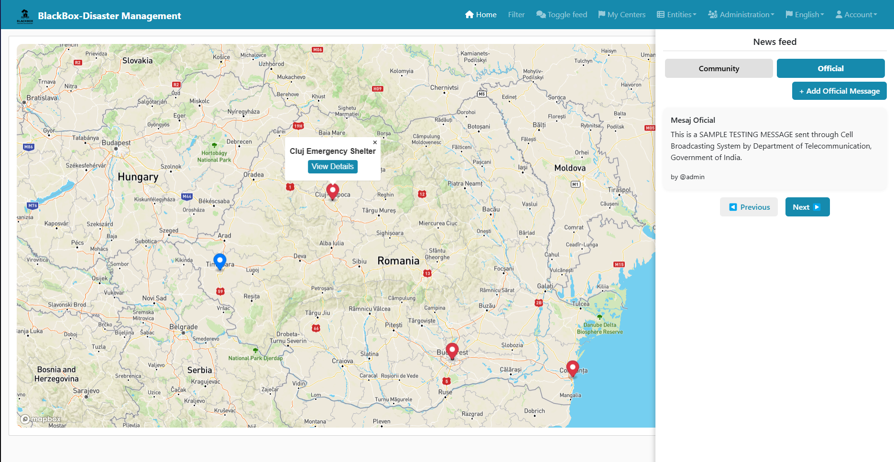
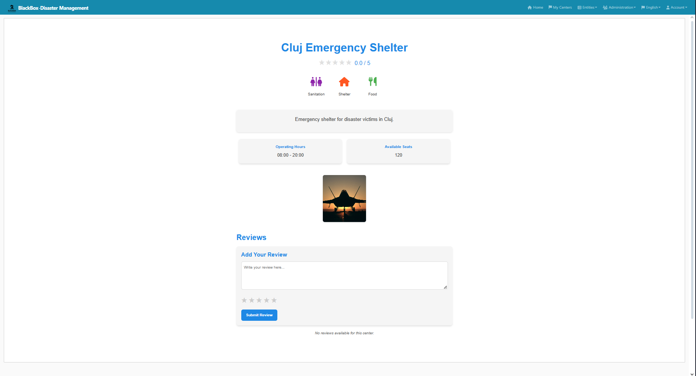

<p align="center">
   
</p>

# 🌐 Disaster Management Platform

---

## 🚀 Overview

DisasterApp is a comprehensive web-based disaster management platform designed to facilitate efficient reporting, tracking, and coordination of disaster events. Built using **Java**, **Spring Boot**, and modern web technologies, the application empowers communities, authorities, and organizations to respond swiftly and effectively to natural and man-made disasters.

---

## ✨ Features

- **Disaster Reporting:** Users can report new disaster events, providing details, location, and media attachments for rapid assessment.
- **Event Tracking:** Real-time tracking of ongoing disasters, including status updates, resource allocation, and affected areas.
- **Resource Management:** Tools for managing shelters, supplies, and personnel, ensuring optimal distribution and utilization during emergencies.
- **Community Engagement:** Integrated messaging and notification system to keep communities informed and connected.
- **Security:** Robust authentication and authorization using OAuth 2.0 / OpenID Connect (Keycloak, Okta, or Auth0 supported).
- **Progressive Web App (PWA):** Optional offline support and mobile-friendly experience.

---

## 🛠️ Technology Stack

- **Backend:** Java, Spring Boot
- **Frontend:** Modern JavaScript (React/Angular/Vue via JHipster)
- **Database:** PostgreSQL
- **Containerization:** Docker, Docker Compose
- **Build Tools:** Maven, Webpack, npm
- **Testing:** Spring Boot tests, Jest for frontend
- **Code Quality:** SonarQube integration

---

## 🏁 Getting Started

1. **Install Docker Desktop** and ensure the Docker engine is running.
2. **Start Keycloak for authentication:**
   ```shell
   docker compose -f src/main/docker/keycloak.yml up
   ```
3. **Create PostgreSQL database** named `disaster-app` with credentials:
   - Username: postgres
   - Password: postgres
4. **Enable baseline data loading** in `application.yml`:
   ```yaml
   baseline-load-enabled: true
   ```
5. **Start the application:**
   ```shell
   .\mvnw
   ```
6. **Fix line ending issues (Windows):**
   ```shell
   npx prettier --write .
   ```

---

## 👨‍💻 Development

- Use `./npmw install` to manage frontend dependencies.
- Run `./mvnw` and `./npmw start` in separate terminals for live development.
- Security settings and OAuth providers can be configured in `src/main/resources/config/application.yml`.

---

## 📦 Building & Deployment

- **Build for production:**
  ```shell
  ./mvnw -Pprod clean verify
  java -jar target/*.jar
  ```
- **Dockerize the app:**
  ```shell
  npm run java:docker
  docker compose -f src/main/docker/app.yml up -d
  ```

---

## 🧪 Testing

- **Backend:** `./mvnw verify`
- **Frontend:** `./npmw test`

---

## 🧹 Code Quality

- **SonarQube:**
  ```shell
  docker compose -f src/main/docker/sonar.yml up -d
  ./mvnw -Pprod clean verify sonar:sonar -Dsonar.login=admin -Dsonar.password=admin
  ```

---

## 🔄 Continuous Integration

- JHipster CI/CD generator available for popular CI systems.

---

## 📚 Documentation & Support

- Generated with JHipster 8.9.0. See [JHipster Documentation](https://www.jhipster.tech/documentation-archive/v8.9.0) for more details.

---

## 📸 Project Visuals & Screenshots

<p align="center">
   
   
</p>

---
